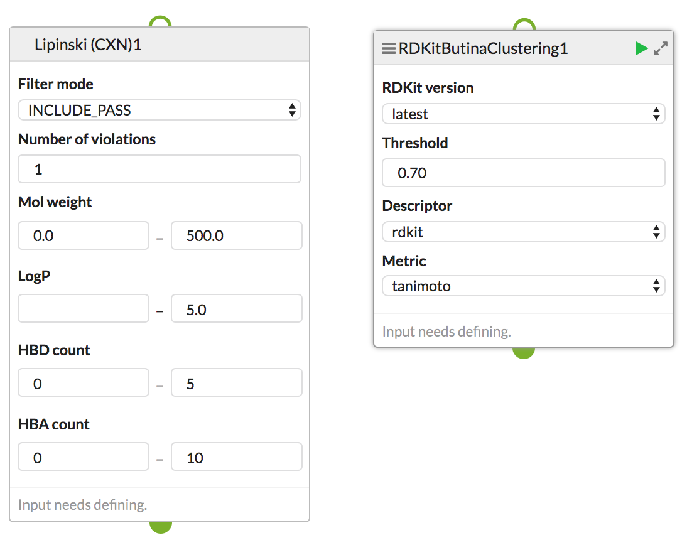

# Squonk Service Descriptors

## Overview

Squonk has a concept of "Service Descriptors" to define services that can be integrated into Squonk.
Providing a service descriptor is enough to make the service available within the Squonk application through
a registration mechanism (this is fairly basic at present). This mechanism is fairly powerful and working fairly well, but future extesions are anticpated.

There are two closely related types of service descriptor, one for HTTP services (aka REST web services) and one for Docker containers that are instantiated to fulful the service request. These descriptors contain the information that is necessary to invoke the request:

* Details of the service (name, description, tags ...) [1]
* Description of the options that the user can specify [2]
* Description of the input(s) (using media types) [3]
* Description of the output(s) (using media types) [3]
* Details of how to invoke the service (HTTP endpoint, Docker image, how to provide inputs/outputs etc.) [4]

[1] Tags provide a mechanism for users to find the services of interest. 
[2] Including data types, whether mandatory, range fields, pick lists.
[3] HTTP services are currently limited to a single input and a single output, though we plan to remove this limitation using multi-part mime.
[4] One particularly relevant part here are "thin descriptors" that determine exactly what information is sent to the service and how the results of the service are incorporated back into the dataset.

This is reflected through a set of Java classes as follows

                             Contains
    ServiceDescriptor (I)  -----------------> SerivceConfig (C)
        |
        |
        | Implements
        |
        V
      DefaultServiceDescriptor (C)
      |                      |
      |                      ---------
      | Extends                      | Extends            
      |                              |
      V                              V
    HttpServiceDescriptor (C)    DockerServiceDescriptor (C)

The (C) and (I) labels indicate a Class or an Interface.
The role of the SerivceConfig is to handle the information that needs to be exposed to a client application, such as the details and the options.
The HttpServiceDescriptor and DockerServiceDescriptor contain the implemntation details that are needed when the service is orchestrated, but do not need to be know to the client.

HTTP Service descriptors are typically defined as part of the service, typically in Java to ensure strong typing, though it's also possible to define them as JSON.
Docker service descriptors are defined as JSON and placed in a location know to Squonk. Necessarily they have to be separate from the definition of the Docker image.
We also plan to support use of YAML as it is less verbose than JSON.

For HTTP services we also often generate Swagger descriptors, but these contain less information and we do not currently use them for any purpose so they are largely untested.

For Docker services Swagger does not directly apply, though in reality the execution of a Docker container would be realised though a REST web services that orchestrates this so potentially that REST service could provide descriptors for all the Docker services it knows about.  

## Examples

Inlcuded are an example of each type

* HTTP descriptor for Lipinski filter using ChemAxon: [see here](lipinski_filter_cxn.json)
* Docker descriptor for performing molecule clustering using RDKit: [see here](cluster_butina.json)

These descriptors result in the following "cells" appearing in the Squonk Computational Notebook: 

Further explanations on these descriptors can be provided.

